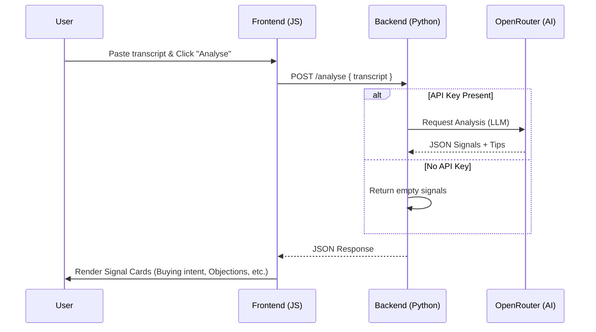

## Model Used

The application uses OpenRouter with:

openrouter/free

The model can be changed using the OPENROUTER_MODEL environment variable.

# NimitAI Transcript Signals

A small web app that analyzes a meeting transcript and returns AI-detected sales signals with a coaching tip for each one.

## What it does

- `POST /analyse` accepts a JSON payload with `transcript`
- The backend calls OpenRouter and asks for clean JSON only
- The frontend lets you paste a transcript and shows results as simple cards

## How it works

## Setup

1. Set `OPENROUTER_API_KEY` in your environment for live LLM analysis.
2. Run `python main.py`.
3. Open `http://localhost:8000`.

## Environment variables

- `OPENROUTER_API_KEY` is used for live LLM analysis; if it is missing, the app returns no signals
- `OPENROUTER_MODEL` is optional and defaults to `openrouter/free`
- `PORT` is optional and defaults to `8000`
- `OPENROUTER_SITE_URL` and `OPENROUTER_APP_NAME` are optional metadata headers for OpenRouter

## LLM used

OpenRouter, via the OpenAI-compatible Chat Completions API.

## Notes

If `OPENROUTER_API_KEY` or `OPENAI_API_KEY` is not set, the app returns an empty signal list.

